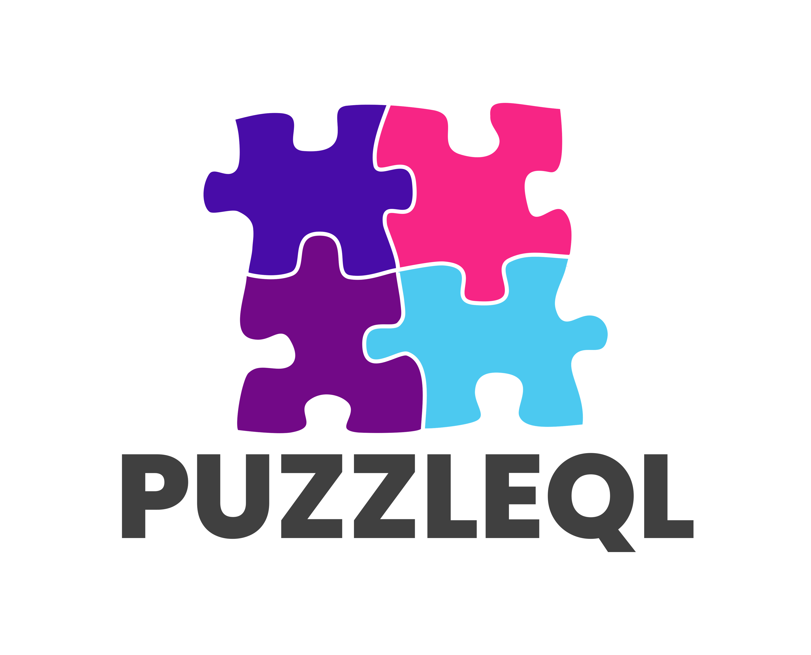
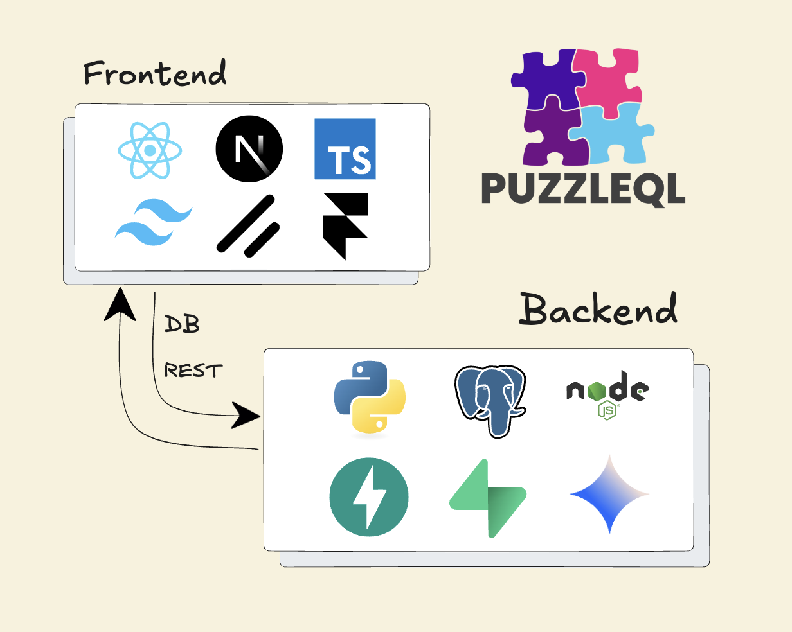
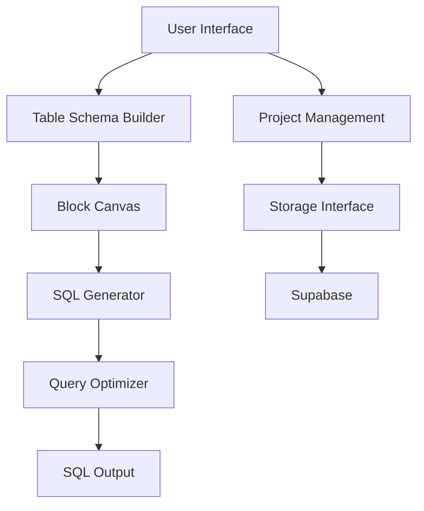

# PuzzleQL

<p align="center">
  
</p>

## 💡 Inspiration

Working with SQL can be a challenging experience for many developers. While SQL is powerful, it often feels outdated compared to modern development tools. Many developers find themselves occasionally needing to work with unfamiliar SQL databases, requiring adaptability and understanding to effectively navigate and manipulate data.

We've all been there—staring at a complex SQL query, trying to mentally parse nested joins, where clauses, and aggregations while battling syntax errors and struggling to visualize the query's logic. What if there was a more intuitive way to build SQL queries?

This inspired us to create **PuzzleQL**—a tool that transforms SQL query creation into an intuitive, Lego-like block-building experience.

## 🔍 What it does

**PuzzleQL** is a visual SQL query builder that allows developers to:

- Create SQL queries by connecting visual blocks, eliminating syntax errors
- Visualize query structure and relationships between tables
- Work effectively with unfamiliar databases through an intuitive interface
- Generate clean, optimized SQL for any supported database type
- Save and organize projects for future reference

Instead of writing raw SQL code, users build queries by connecting logical blocks that represent SQL operations (SELECT, JOIN, WHERE, etc.). This visual approach makes query construction more intuitive and less error-prone, especially for developers who don't work with SQL every day.

## ⚙️ How we built it

### Frontend

- **Next.js**: A React framework for building the user interface
- **React**: For component-based UI development
- **TailwindCSS**: For styling with utility classes
- **Supabase**: For cookie-based authentication

### Backend

- **Node.js**: Runtime environment for server-side logic
- **Python**: For SQL parsing and optimization
- **Custom SQL Parser**: For validating and optimizing the generated SQL
- **Supabase**: For storing user data and made queries



## 🏗️ Architecture

PuzzleQL follows a clean architecture pattern:

- **Data Models**: Core entities (Project, ProjectTable, etc.) defined with TypeScript
- **Storage Interface**: Clean interface pattern allowing swappable storage backends
- **Components**: Modular UI components for project management and query building
- **Block-Based Builder**: Visual interface for SQL query construction



## 🔧 Features

- **Visual Block Builder**: Drag-and-drop interface for building SQL queries
- **Multi-Database Support**: Works with PostgreSQL and plans to support MySQL, SQLite, and MS SQL
- **Project Management**: Save, organize, and reuse queries, separate projects
- **Database Connection**: Optional direct connection to databases
- **SQL Export**: Generate and export SQL queries
- **Error Prevention**: Visual building prevents syntax errors
- **Query Validation**: Real-time validation of query structure

## 🪦 Challenges we ran into

- Creating an intuitive visual representation of SQL concepts
- Handling different SQL dialects across database types
- Balancing simplicity for beginners with power for advanced users
- Designing a flexible storage system that caters to our users needs

## 😁 Accomplishments we're proud of

- Developing an intuitive block-based visual builder for SQL
- Creating a clean architecture that separates concerns and allows for future expansion
- Building a polished user experience with responsive design

## 📖 What we learned

- Advanced React patterns for drag-and-drop interfaces
- SQL parsing and optimization techniques
- Interface-based design for swappable dependencies

## 🚀 Getting Started

### Prerequisites

- Node.js 18+ and npm
- Python 3.8+ (for backend services)

### Installation

1. Clone the repository
```bash
git clone https://github.com/yourusername/puzzleql.git
cd puzzleql
```

2. Install frontend dependencies
```bash
cd frontend
npm install
```

3. Install backend dependencies
```bash
cd ../backend
pip install -r requirements.txt
```

4. Start the development servers
```bash
# In frontend directory
npm run dev

# In backend directory
python server.py
```

5. Open your browser to `http://localhost:3000`

## 🤔 What's next for PuzzleQL

- **Enhanced Visualization**: More advanced visualization of query execution plans
- **Collaborative Features**: Real-time collaboration on query building
- **AI Assistance**: AI-powered suggestions and optimizations for queries
- **Schema Import**: Automatically import database schemas
- **Query Execution**: Direct query execution and result visualization
- **Template Library**: Community-shared query templates
- **Supabase Integration**: Cloud storage and authentication

## 📄 License

This project is licensed under the MIT License - see the LICENSE file for details.